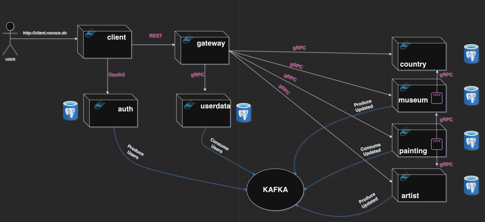

# Rococo

* Web-приложение для хранения музеев, художников и их картин.
* Просмотр контента доступен для неавторизованных пользователей.
* Добавление и редактирование требует oauth2 авторизацию.

### Взаимодействие компонент

Бэкенд реализован в виде микросервисов, c которыми фронт взаимодействует с помощью gateway.

Полная схема:

## Запуск сервисов

### Локальный запуск

### Запуск в Docker-контейнерах

## E2E-Тесты
